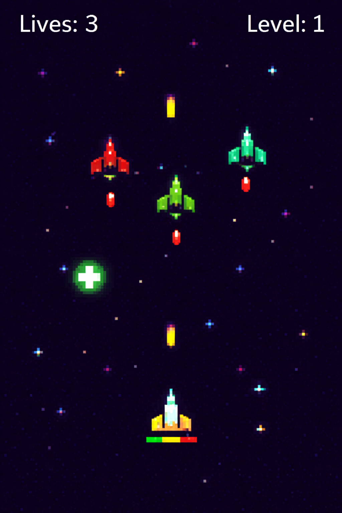

# Space Invaders Game (Pygame)

A simple Space Invaders-style game built with **Pygame**.

From the slides, the game includes:
- Lives (top-left) and Level (top-right) UI
- Enemy waves spawning and moving down
- Enemies shoot randomly
- Player movement and shooting
- Rewards that fall down and restore health when collected
- Mask-based collision (pixel-perfect)

This code is reconstructed from the project slides PDF and keeps a similar multi-file structure (a `space/` package). fileciteturn1file0


## Controls
- Move: **W A S D**
- Shoot: **SPACE**
- Start game: **Mouse click** on the menu screen

## Run
```bash
pip install -r requirements.txt
python main.py
```

## Project structure
```
main.py
requirements.txt
space/
  constants_game.py
  laser.py
  class_ship.py
```

## Notes
The original project likely used image assets (ships/lasers/background).  
This version uses simple drawn Pygame surfaces so it runs without extra asset files.
